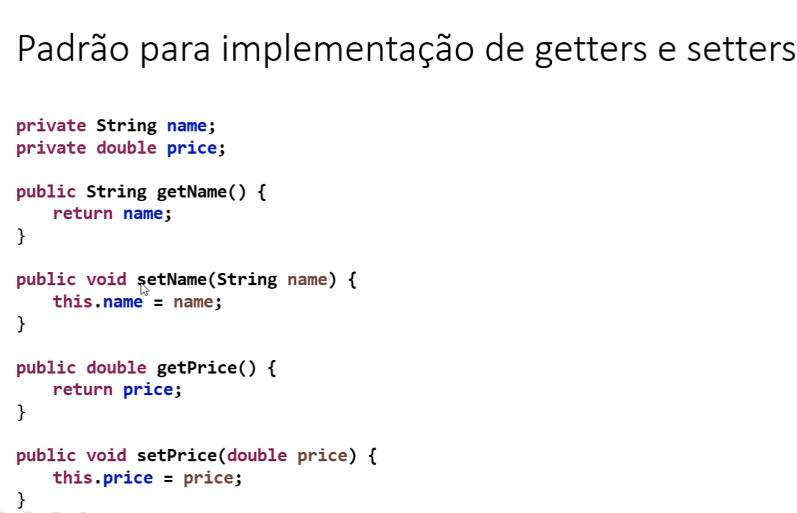

Encapsulamento

- É um princípio que consiste em esconder detalhes de implementacão de
  uma classe, expondo apenas operacões seguras e que mantenham os objetos
  de um estado consistente.

- Regra de ouro: o objeto deve sempre estar em um estado consistente,
  e a própria classe deve garantir isso.

Analogia:
Aparelho de som: internamente tem várias operacões acontecendo, mas
o usuário não pode acessar diretamente os circuitos, disponibilizando
aos usuários somente operacões que não corrompem a integridade do aparelho.
Ex: pause, play, prev, next

Regra geral básica

- Um objeto NÃO deve expor nenhum atributo(modificador de acesso private)

- Os atributos devem ser acessados por meio de métodos get e set
  - Padrão JavaBeans: https://pt.wikipedia.org/wiki/JavaBeans

