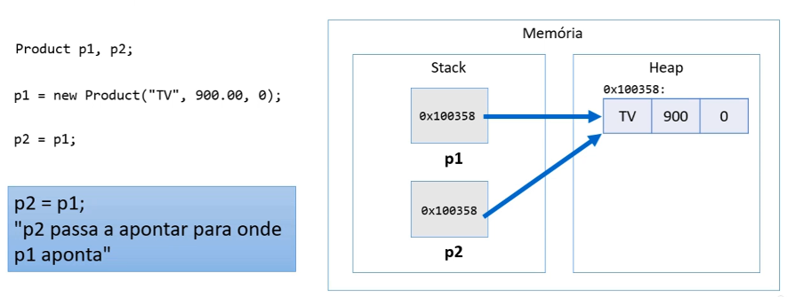
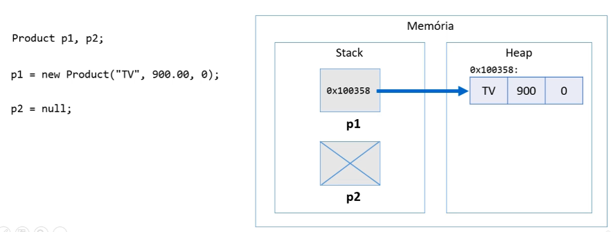
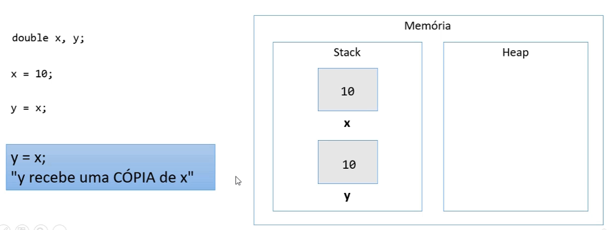
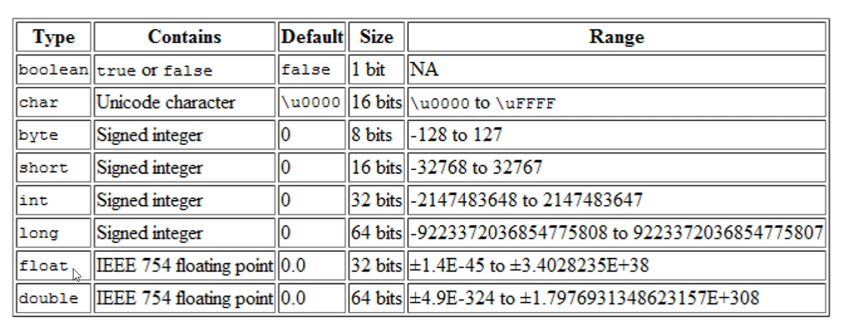
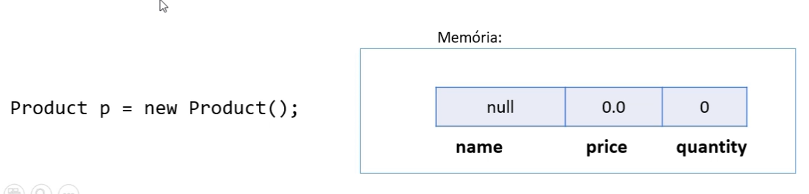
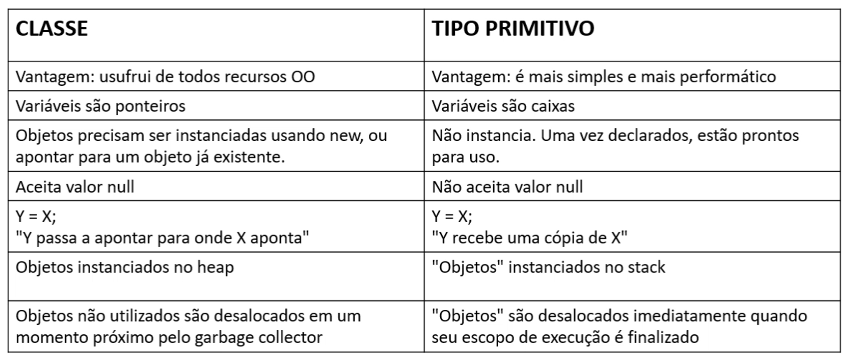

# Tipos referência vs. tipo valor

## Em java, Classes são tipos referência

Variáveis cujo tipo são classes não devem ser entedidas como caixas, 
mas sim "tentáculos" (ponteiros) para caixas.

## Valor "null"

Tipos referência aceitam o valor "null", que indica que a variável
aponta para ninguém.

## Tipos primitivos são tipos valor

Em java, tipos primitivos são tipos valor. Tipos valor são CAIXAS e não ponteiros.

### Oito tipos primitivos em Java

## Valores padrão

Quando alocamos(new) qualquer tipo estruturado(classe ou array),
são atribuidos valores padrão aos seus elementos.

- números: 0
- boolean: false
- char: caractere código 0
- objeto: null

## Resumo

### Tipos referência vs. tipo valor

