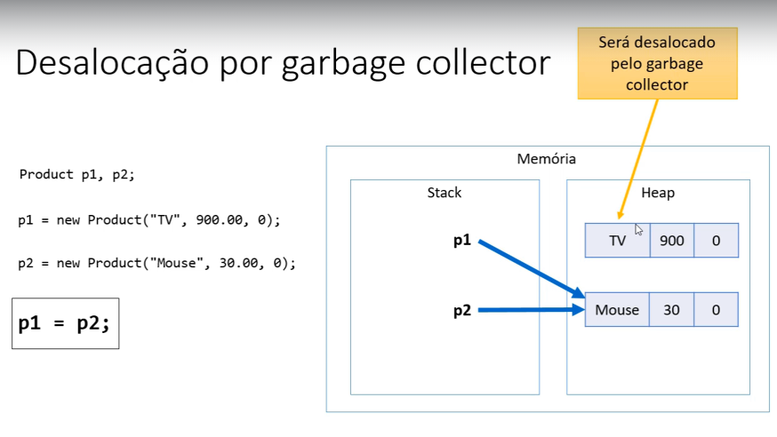

# Desalocação de memória - garbage collector e escolo local

## Garbage collector

É um processo que automatiza o gerenciamento de memória 
de um programa em execução.

O garbage collector monitora os objetos alocados dinamicamente
pelo programa(no heap), desacolando aqueles que não estão mais 
sendo utilizados.

### Desalocação por garbage collector

## Resumo

- Objetos alocados dinamicamente, quando não possuem mais
referência para eles, serão desalocados pelo garbage collector

- Variáveis locais são desalocadas imediatamente assim que seu
escopo local sai de execução 