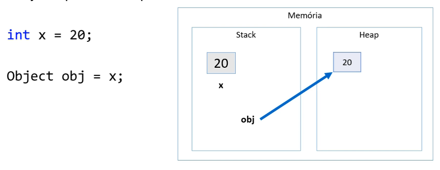
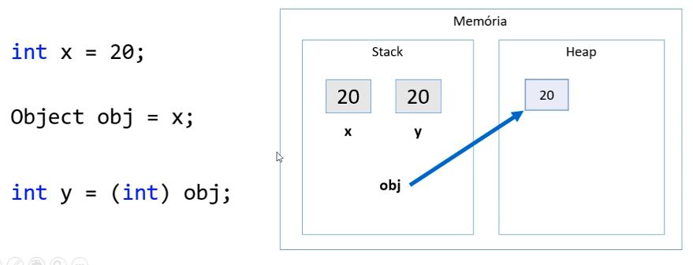
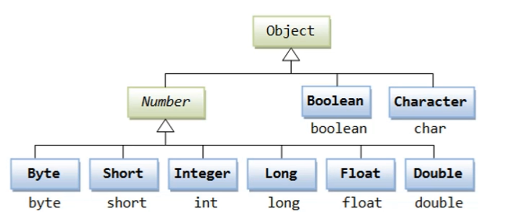
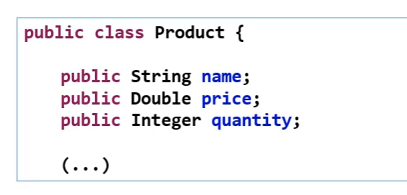

# Boxing, unboxing e wrapper classes

### Boxing

- É um processo de conversão de um objeto tipo **valor** para um objeto tipo **referência** compatível.

 

### Unboxing

- É o processo de conversão de um objeto tipo **referência** para um objeto tipo **valor** compatível.

### Wrapper classes

- São classes equivalentes aos tipos primitivos
- Boxing e unboxing é natural na linguagem
- Uso comum: campos de entidades em sistemas de informação(IMPORTANTE!)
  - Pois tipos referência (classes) aceitam valor null e usufruem dos recursos OO

