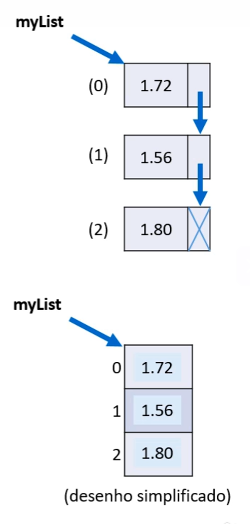

# Listas - Parte 1

### Checklist

- Conceito de lista
- Tipo **List** - Declaração, instanciação
- Demo
- Referência: <https://docs.oracle.com/javase/10/docs/api/java/util/List.html>
- Assuntos pendentes:
  - interfaces
  - generics
  - predicados(lambda)

## Listas

- Lista é uma estrutura de dados:
  - Homogênea (dados do mesmo tipo)
  - Ordenada (elementos acessados por meio de posições)
  - Inicia vazia, e seus elementos sã oalocados sob demanda
  - Cada elemento ocupa um "nó"(ou nodo) da lista

- Tipo(interface): List
- Classes que implementam: ArrayList, LinkedList, etc.

- Vantagens:
  - Tamanho variável
  - Facilidade para se realizar inserções e deleções

- Desvantagens:
  - Acesso sequencial aos elementos **
    -  ** ArrayList é uma "mistura" entre vetor e lista, otimizando o acesso

