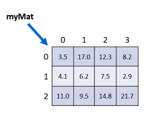

# Matrizes

---
## Checklist
- Revisão do conceito de matriz
- Declaração e instanciação
- Acesso aos elementos / como percorrer uma matriz
- Propriedade length

---

Em programação, "matriz" é o nome dado a arranjos bidimensionais.

*Atencão: "vetor de vetores"

- Arranjo (array) é uma estrutura de dados:
  - Homogênea (dados do mesmo tipo)
  - Ordenada (elementos acessados por meio de posições)
  - Alocada de uma vez só, em um bloco contíguo de memória

- Vantagens:
  - Acesso imediato aos elementos pela sua posição

- Desvantagens:
  - Tamanho fixo
  - Dificuldade para se realizar inserções e deleções

