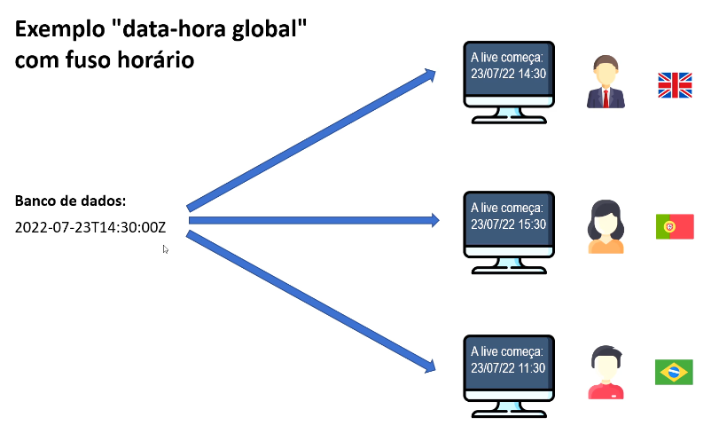

# Conceitos importantes

---

- Data-[hora] local:
  - ano-mês-dia-[hora] sem fuso horário
  - [hora] opcional

- Data-hora global:
  - ano-mês-dia-hora com fuso horário

- Duração:
  - tempo decorrido entre duas data-horas

*14:30:00**Z** indica horário de Londres

## Quando usar?

### - Data-[hora] local:

Quando o momento exato não interessa a pessoas de outro fuso horário.
Uso comum: sistema de região única, Excel.

Data de nascimento: "15/06/2001"\
Data-hora da venda: "13/08/2022 às 15:32" (presumindo não interessar o fuso horário)

### - Data-hora global:

Quando o momento exato interessa a pessoas de outro fuso horário.
Uso comum: sistemas multi-região, web.

Quando será o sorteio? "21/08/2022 às 20h (horário de São Paulo)"\
Quando o comentário foi postado? "Há 17 minutos"\
Quando foi realizada a venda? "13/08/2022 às 15:32 (horário de São Paulo)"\
Início e fim do evento? "21/08/2022 às 14h até 16h (horário de São Paulo)"
    
