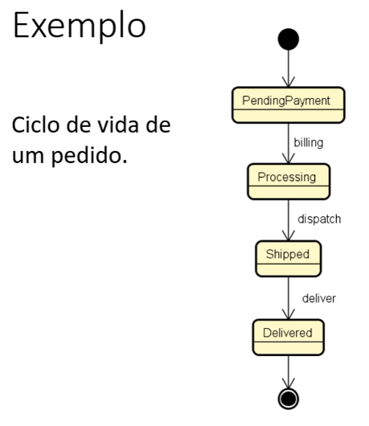
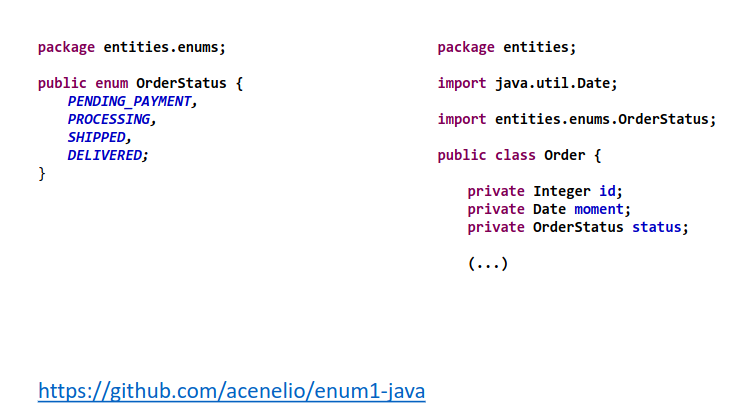
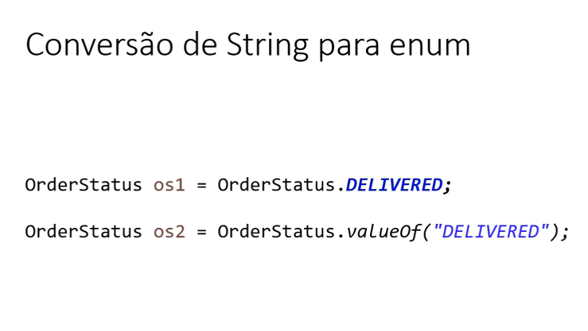
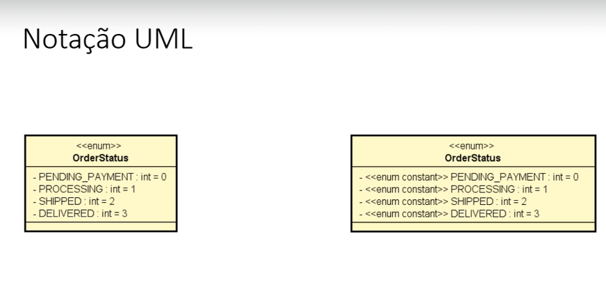

## Checklist

- Definição / discussão
- Exemplo: estados de um pedido
- Conversão de string para enum
- Representação UML

# Enumerações

É um tipo especial que serve para especificar de foruma literal
um conjunto de constantes relacionadas 

- Palavra-chave em Java: enum

- Vantagens:
  - melhor semântica
  - código mais legível e auxiliado pelo compilador

