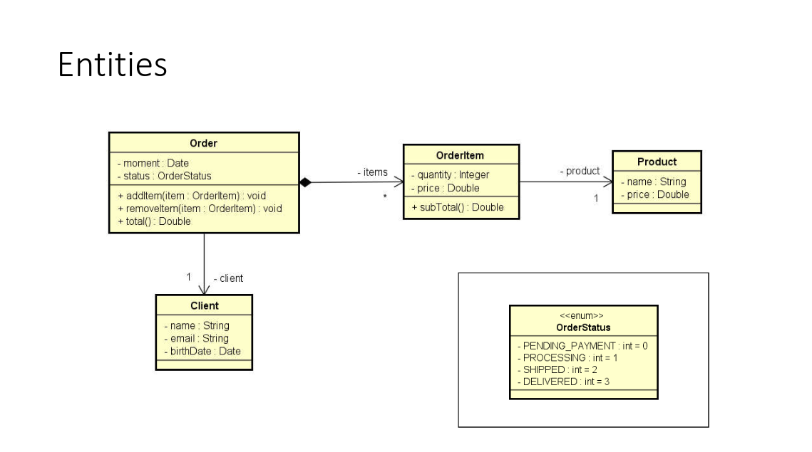
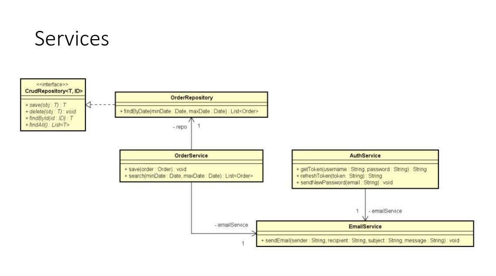

# Vamos falar um pouco sobre design?

## Categorias de classes

Em um sistema orientado a objetos, de um modo geral "tudo" é objeto.

Por questões de design tais como organização, flexibilidade, reuso,
delegação, etc., há várias categorias de classes:

- Views
- Controllers
- Entities
- Services
- Repositories

### Inicialmente vamos falar sobre entidades

### Exemplo de serviços

