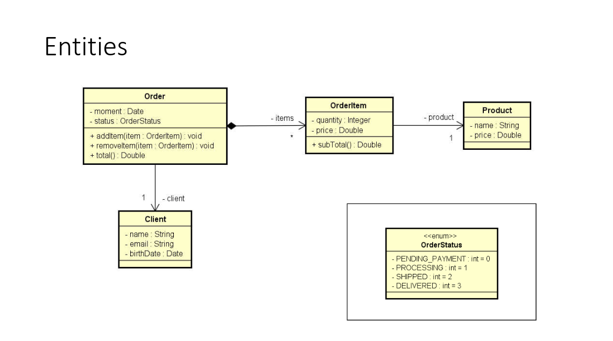
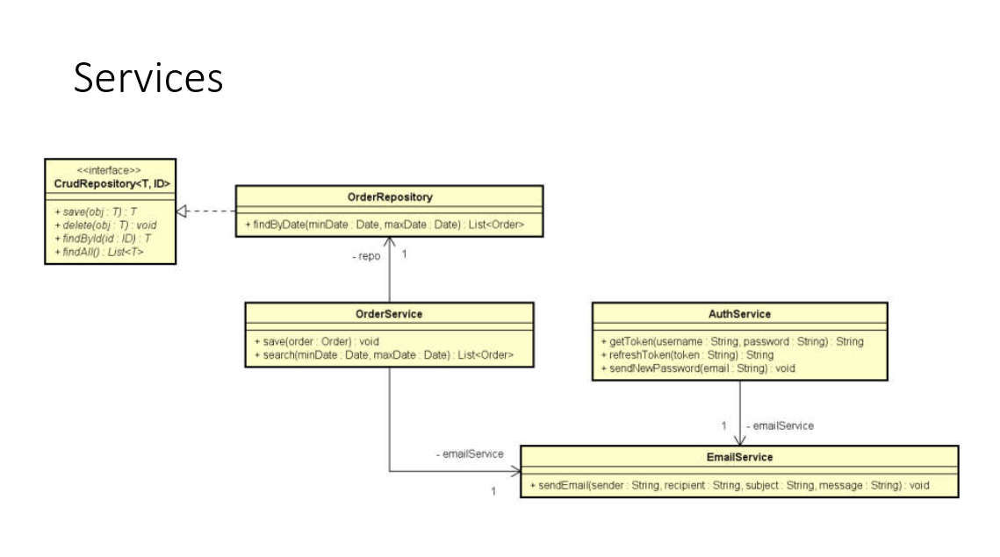

# Composição

É um tipo de associação que permite que um objeto contenha outro

Relação "tem-um" ou "tem-vários"

- Vantagens:
  - Organização: divisão de responsabilidades
  - Coesão
  - Flexibilidade
  - Reuso

* Nota: embora o símbolo UML para composição(todo-parte) seja o diamante
preto, neste contexto estamos chamando de composição qualquer associação
tipo "tem-um" e "tem-vários".

### Entities

### Services

